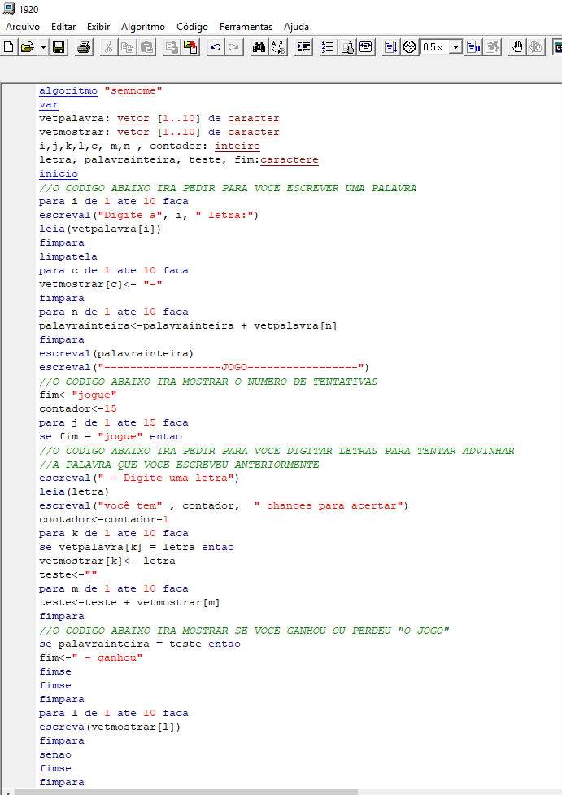
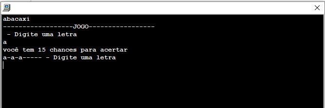
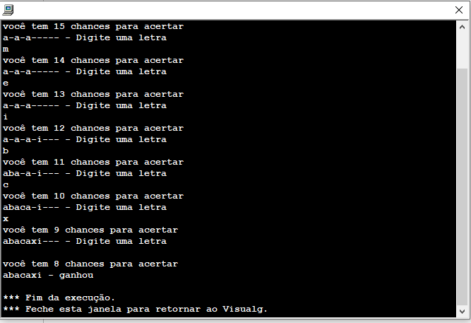

# VisualG
 Exercícios de lógica realizados  no software VisualG
## Jogo da forca

- Código
<h2 align="center">
  
</h2>

- Definindo a palavra a ser adivinhada
<h2 align="center">
  
</h2>

- Jogando
<h2 align="center">
  
</h2>